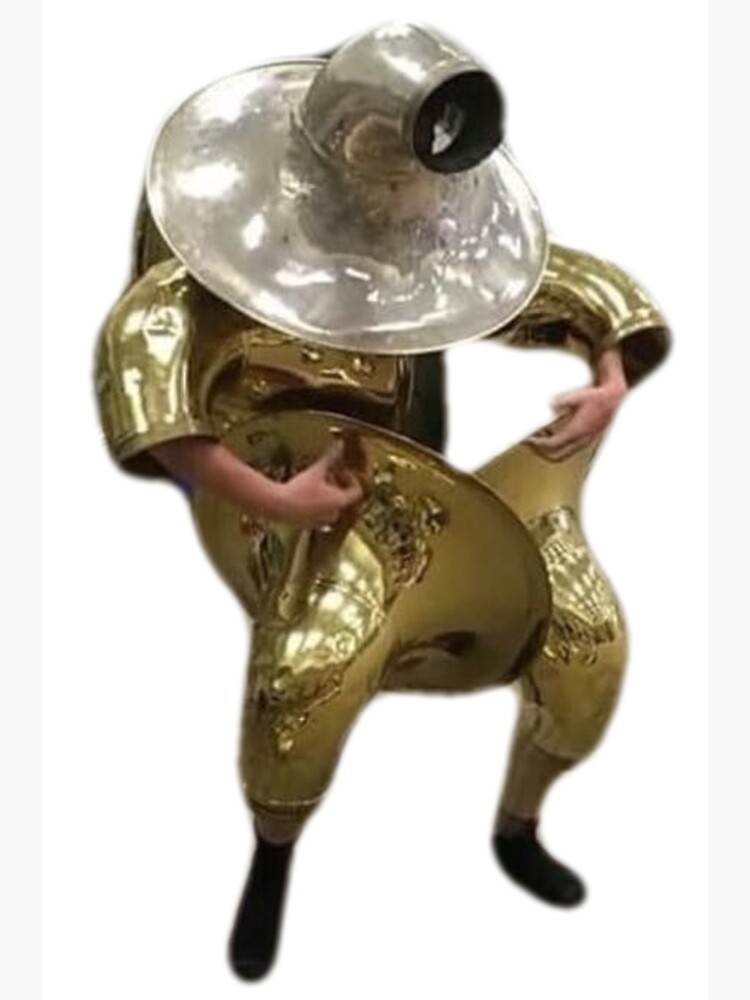

# Brasstard

The Brasstard, or simply Brasstard, was a chaotic evil musical spirit of pure malice who was bent on destroying those who played musical tunes.

| Basic Information | |
| - | - |
| Title(s) | Brasstard Tuba Man |
| Home | [Limbo](../Locations/Planes/limbo.md) |
| Race | Unknown |
| Age  | Unknown |

| Statistics | |
| - | - |
| Alignment | Chaotic Evil |
| Challenge Rating | 20 (Epic) |

## Description

Brasstard resembled a humanoid covered in tubas and other brass instruments, but was also huge given it was 15+ feet tall and wide. It is said the Brasstard is summoned when a specific malevolent energy is exposed to good music, and it can only be dispersed when defeated in combat or sufficiently powerful music overpowers it.

## History

During [13](13/13.md)'s encounter with [Rystrasz](rystrasz.md), where they had to entertain him with music, Brasstard was summoned at the end of the concert to cast judgment upon the music lovers in the room. 13 attempted to kill it, but Brasstard was incredibly powerful, but was eventually melted into a pile by Rytrasz's incredible beam of fire.

## Powers

Brasstard could use its tuba arms to let out an abhorrent note that did incredible physical and psychological damage to those who heard. In addition, its body being made of pure brass gave it a powerful 22 AC.
