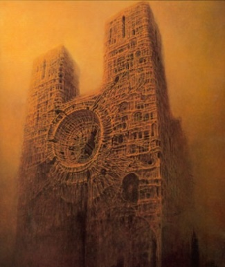

# Centipede Demon

The "Centipede Demon", or sometimes known as Six's Bane, is a Obyrithian demon that scours the lands of the [Flats of Limbo](../Locations/Planes/limbo.md#the-flats). They were first mentioned in story when Six, Gorton, and Troyes of [13](13/13.md) encountered them in a cathedral of bones. During the encounter, [Six](13/six.md) sold his soul to the demon to obtain a very powerful variant of an elvish moonblade. It was later discovered that through this transaction Six was bounded to the moonblade such that every time he used it, part of his soul would devolve into nothingness.

| Basic Information | |
| - | - |
| Alias(es) | The Centipede Demon [Six](13/six.md)'s Bane |
| Race | [Obyrith](https://forgottenrealms.fandom.com/wiki/Obyrith) |

The Cathedral controlled by the demon:

## Description

TODO
