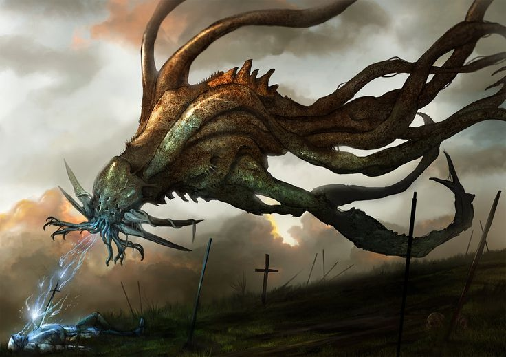

# Reigith the Deformed

Reigith was a aberration creature invented in the ruins of [Kisirith](../Locations/Towns/kisirith.md) and one of the primary antagonists during the [Rise of Ebrihan](../Campaigns/caelian_trilogy.md#rise-of-ebrihan) arc.

| Basic Information | |
| - | - |
| Home | [Kirisia](../Locations/Land/caelus.md#kisiria), [Caelus](../Locations/Land/caelus.md) |
| Sex | Male |
| Race | N/A |
| Born  | Between 1305-1316 PA |
| Died | 1326 PA |

| Family | |
| - | - |
| Creator(s) | [Imperator of the Fields](oric_valdes.md) |

| Statistics       |              |
| ---------------- | ------------ |
| Alignment        | True Neutral |
| Challenge Rating | 9            |

## Description

TODO

## History

TODO

## Powers

TODO
