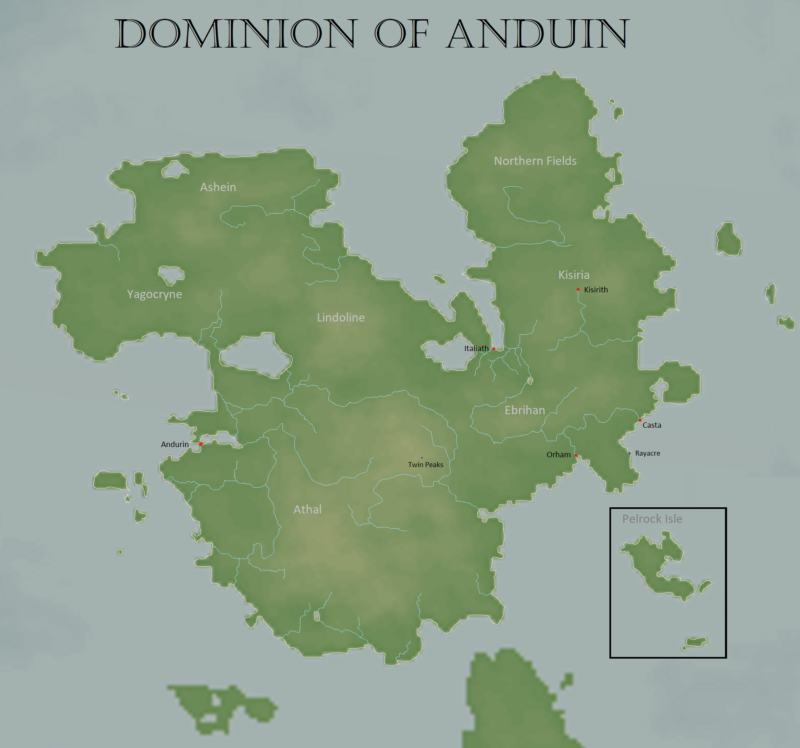

# Dominion of Anduin

| General Information | |
| - | - |
| Full name | The Dominion of Anduin |
| Type | Absolute-Monarchy |
| Capital | Andurin |
| Sub-states | Athal Ebrihan Kisiria Yagocryne Lindoline Ashein Northern Fields

| History | |
| - | - |
| Formed from | Anduin's arrival to Caelus |
| Established | 0 PA |
| Disestablished | 1326 PA |
| Predecessor | Old World Orcish and Dwarvish native tribes |
| Successor | [Caelian Empire](caelian_empire.md) |
| Notable events | [Kisiri's uprising](../../Characters/kisiri.md#fall-into-darkness) Plague of 900s [War of the Fields](../../Events/war_of_the_fields.md) Rise of Ebrihan |

| Area | |
| - | - |
| 1326 PA | 1,169,259 km2 |

| Population | |
| - | - |
| 1326 PA | 10,600,000 |

## Description

## Geography

## Government

## History