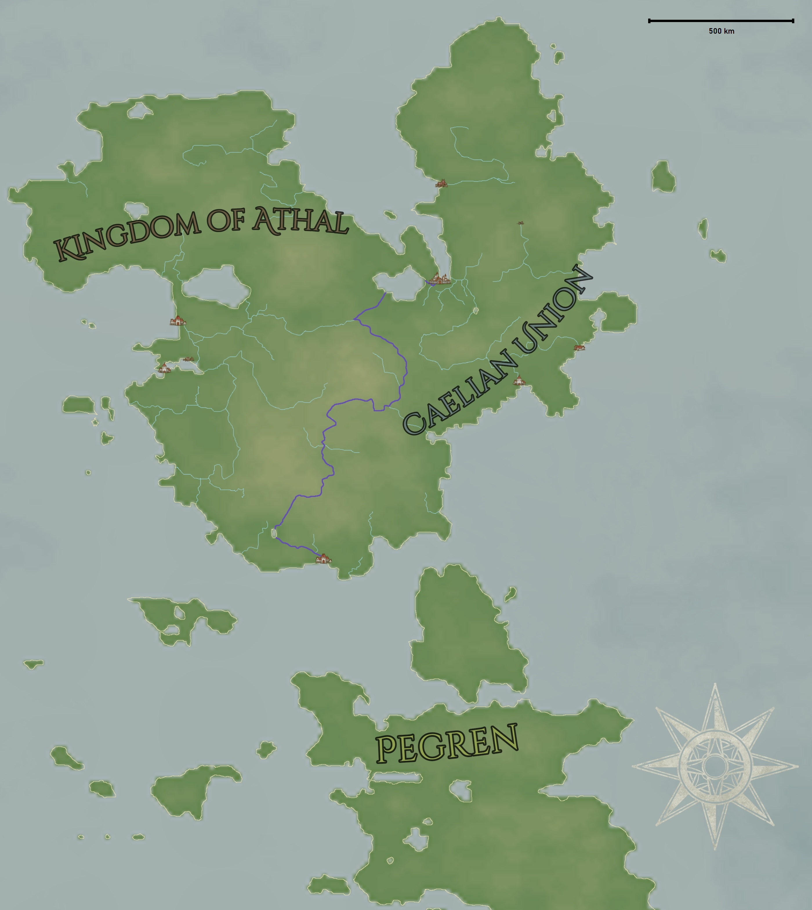

# Kingdom of Athal

The Kingdom of Athal is a [Caelian](../../Locations/Land/caelus.md) nation founded from the ruins of the [Caelian Empire](./caelian_empire.md) at the beginning of the [5th Age](../../Events/timeline.md#5th---age-of-the-kings).

| General Information | |
| - | - |
| Full name | The Divine Kingdom of Athal |
| Alias(es) | The New Dominion |
| Type | Spiritual Theocracy |
| Capital | TODO |
| Sub-states | Athal Ashein Yagocryne Lindoline |

| History | |
| - | - |
| Formed from | Independence from North & Central Meridia |
| Established | 72 5A |
| Age | 114 in 186 5A |
| Predecessor | [Caelian Empire](caelian_empire.md) |
| Notable events | [Great Cataclysm](../../Events/great_cataclysm.md) |

| Area | |
| - | - |
| 72 5A | 703,535 km2 |

| Population | |
| - | - |
| 186 5A | 4,526,000 |

## Contents

- [History](#history)
  - [Formation](#formation)

## History

### Formation

During the events of the [great cataclysm](../../Events/great_cataclysm.md), Athal was an anarchy state not yet absorbed into the Caelian Union. In 9 5A, the collective powers of Northern and Central Meridia claimed the Athal region of their own, which resulted in conflicts in the channel between the regions. Since Athal was not a formed state, they fell to the Meridian powers within months. For the following 63 years, Athal was ruled brutally by the Meridians, until the political influence of Eastern Meridia's [Six](../../Characters/13/six.md) and his [Mors Marauders](../../Factions/Organizations/mors_marauders.md). In 72 5A, Athal was given independence, and the Kingdom of Athal was formed.

TODO
