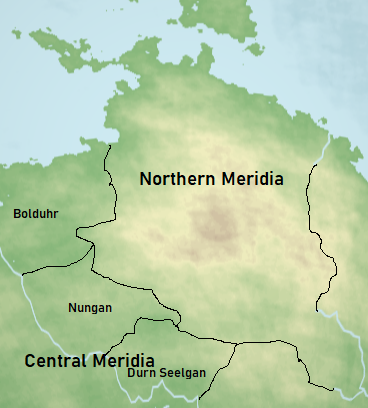
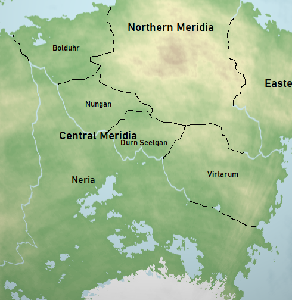
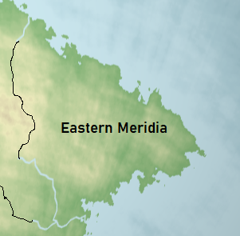

# Meridian States

The history of [Meridia](../../Locations/Land/meridia.md) is vast and complex, including the rise and fall of states. This article details the information on the different states in the region of Meridia.

## Contents

- [Northern Meridia](#northern-meridia)
- [Western Meridia](#western-meridia)
- [Central Meridia](#central-meridia)
- [Eastern Meridia](#eastern-meridia)

## Northern Meridia

| Area | |
| - | - |
| 1326 PA | 2,800,000 km2-3,100,000 km2 |

| Population | |
| - | - |
| 1326 PA | 22,211,840 |

## Western Meridia

| Area | |
| - | - |
| 1326 PA | 7,800,000 km2± 500,000 km2 |

| Population | |
| - | - |
| 1326 PA | 62,000,000 |
| 1344 PA | 57,688,000 |

## Central Meridia

| Area | |
| - | - |
| 1326 PA | 8,890,000 km2± 1,000,000 km2 |

| Population | |
| - | - |
| 1326 PA | 12,692,480 |

## Eastern Meridia

| History | |
| - | - |
| Formed from | TODO |
| Established | 0 PA |
| Conquered | 1338 PA |
| Reestablished | 1344 PA |
| Predecessor | Old Meridian pioneers |
| Successor | |
| Notable events | [Meridian Wars](../../Events/meridian_wars.md) |

| Area | |
| - | - |
| 1326 PA | 1,800,000 km2-2,500,000 km2 |

| Population | |
| - | - |
| 1326 PA | 9,115,680 |

## Description

TODO

## Geography

## Government

## History
