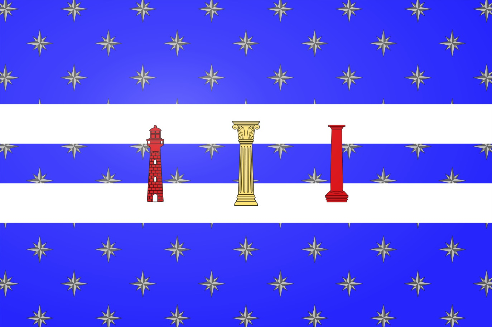

# Republic of Ismaia

The United Republic of Ismaia is a major nation, and former colony of the [Mavellian Empire](mavellian_dynasty.md) which spans the entirety of the north of the [Old World](../../Locations/Land/old_world.md).

| General Information | |
| - | - |
| Full name | The United Republic of Ismaia |
| Alias(es) | Ismaia |
| Type | Democratic-Republic |
| Capital | [Trita](../../Locations/Towns/trita.md) |
| Sub-states | TODO |

| History | |
| - | - |
| First Government | Senate of Nine |
| Established | 196 5A |
| Predecessor | Mavell-Ismaia Colonies |
| Notable events | [First Migration](../../Locations/Land/old_world.md#first-western-migration-24-29) [Ismaian Revolution](../../Locations/Land/old_world.md#wars-of-independence-188-211) |

| Area | |
| - | - |
| 315 5A | 6,500,000 km2 |

| Population | |
| - | - |
| 1326 PA | 10,600,000 |

## Description

TODO

## Geography

## Government

## History
