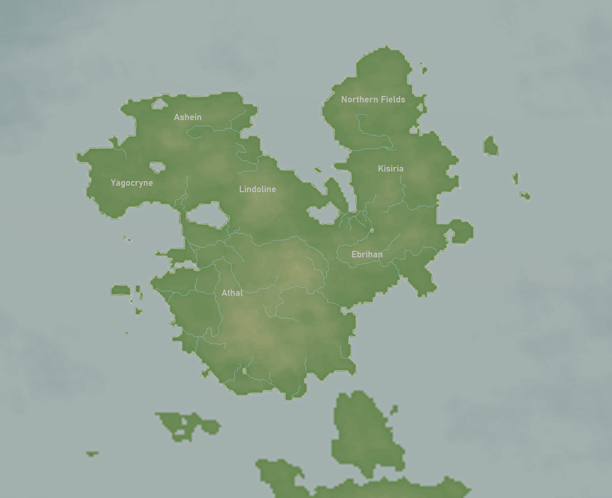

# Caelus

Caelus is a continent on the planet of [Pulchra](../Planes/pulchra.md) and is located in the [south eastern corner](../Planes/pulchra.md#south-eastern-corner). It is most commonly known as the location for the kingdom of the [Dominion of Anduin](../../Factions/Nations/dominion_of_anduin.md), the [Caelian Empire](../../Factions/Nations/caelian_empire.md), and the primary location for the events surrounding the [Great Cataclysm](../../Events/great_cataclysm.md). The [Caelian Trilogy](../../Campaigns/caelian_trilogy.md) adventure series also primarily takes place on the continent of Caelus.

| Geography | |
| - | - |
| Type | Continent |
| Region | South East Corner |
| Area | 1,169,059 km2 (451,376 mi2)  |

| Society | |
| - | - |
| Demonym | Caelian |

| Races | |
| - | - |
| 1326 PA | 94% Human 3% Half Races 3% Other |
| 1343 PA | 97% Human 2% Half Races 1% Other |
| 162 PC | 80% Human 8% Half Races 6% Orc 2% Dwarf 2% Elf 2% Other |

| Population | |
| - | - |
| 0 PA | 28,000 settlers 400,000-700,000 natives |
| 1326 PA | 10,600,000 |
| 1343 PA | 9,120,000 |
| 162 PC | 7,300,000 |

## Contents

- [Geography](#geography)
  - [Athal](#athal)
  - [Ebrihan](#ebrihan)
  - [Kisiria](#kisiria)
  - [Northern Fields](#northern-fields)
- [History](#history)
- [Independent States](#independent-states)
  - [Natives](#natives)
  - [Dominion of Anduin](#dominion-of-anduin)
  - [Caelian Empire](#caelian-empire)
  - [Caelian Union](#caelian-union)
  - [Kingdom of Athal](#kingdom-of-athal)

## Geography

Caelus is geographically split by 7 different regions, each with their own history. All together, Caelus is a contiguous island continent. The region known as Caelia is the culmination of Caelus and the surrounding islands, including Pegren.

### Athal

### Ebrihan

### Kisiria

### Northern Fields

## History

## Independent States

### Natives

Before the arrival of Anduin and settling of the Dominion, various native communities comprised of Orcs and Dwarves existed on the continent. Some Elven cities were also located on the continent, albeit on the southern tip, and when settlers arrived, the Elven communities were able to integrate fairly easily. Integration was not so easy for the Dwarven and Oricish communities however, so many were forced to migrate to the Northern Fields, Ashein, and Kisiria.

The ancient dragon [Miirakail](../../Characters/miirakail.md) also inhabited Caelus, likely before any other life on the continent. All that is is known about where is that he likely lived among the mountains of Athal or Lindoline.

### Dominion of Anduin

The [Dominion](../../Factions/Nations/dominion_of_anduin.md) was founded in 0 PA, or 1256 of the [4th Age](../../Events/timeline.md#4th---age-of-the-ancients), and within 160 years had claimed all of the area of the continent, including Pelrock Isle. During its existence, many of the natives of Caelus were either segregated to the Northern Fields or Ashein, integrated, or migrated off of the continent.

### Caelian Empire

In 1326 PA, under the command of [Oric Valdes](../../Characters/oric_valdes.md), the Dominion was usurped and reorganized into the [Caelian Empire](../../Factions/Nations/caelian_empire.md). For 17 years the Empire ruled and invaded surrounding lands by land and sea, nearly conquering the entirety of the south eastern corner and far beyond until its collapse with the death of High Lord Oric Valdes. The invasions are known as the [Meridian Wars](../../Events/meridian_wars.md), and the death toll and destruction caused was so great it paved the struggle for the next several generations. After the occurrence of the [Great Cataclysm](../../Events/great_cataclysm.md), the years required for full societal recovery required centuries of time.

### Caelian Union

After the fall of the Caelian Empire, the eastern regions banded together to form the Caelian Union. They existed as a puppet state during the first few decades of the 5th Age, until they were granted complete independence by Eastern Meridia in 51 5A.

### Kingdom of Athal

During the events of the great cataclysm, Athal was an anarchy state not absorbed into the Caelian Union. In 9 AD, the collective powers of Northern and Central Meridia claimed the Athal region of their own, which resulted in conflicts in the channel between the regions. Since Athal was not a formed state, they fell to the Meridian powers within 9 months. For the following 63 years, Athal was ruled brutally by the Meridians, until the political influence of Eastern Meridia's [Six](../../Characters/13/six.md) and his [Mors Marauders](../../Factions/Organizations/mors_marauders.md). In 72 5A, Athal was given independence, and the Kingdom of Athal was formed.
