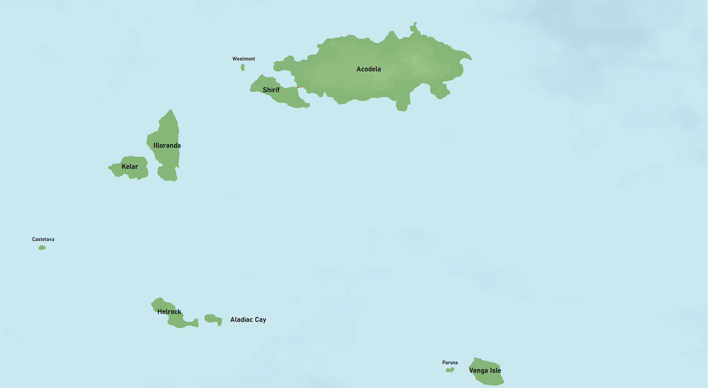

# Commodian Isles

The Commodian Isles are a collection of islands in the heart of the [South Eastern Sea](../Planes/pulchra.md#south-eastern-corner) and the primary location for the events of the [Commodian Tales](../../Campaigns/commodian_tales.md) adventure.

| Basic Information | |
| - | - |
| Type | Archipelago |
| Region | [South Eastern Sea](../Planes/pulchra.md#south-eastern-corner) |
| Area | 122,855 km2 (47,435 mi2)  |

| Society | |
| - | - |
| Demonym | Commodian |

| Races | |
| - | - |
| 162 PC | 40% Human 13% Elf 10% Half Races 8% Dwarf 6% Orc 23% Other |

| Population | |
| - | - |
| 162 PC | 626,807 |

## Geography

The Commodian Isles consist of 12 islands of various size and history:

- Acodela
- Shirif
- Kelar
- Illoranda
- Westmont
- Helrock
- Aladiac Cay
- Castetava
- Venga Isle
- Paruna
- Unknown
- Unknown

## History

**Note**: Before New Era (BNE) refers to the time before the "invasion of the east " of the Isles.

- 1200-1500 BNE - First settlers arrive on the islands of Paruna and South Calmest Enclave.
- 900-1200 BNE - During a large migration from the ancient west, many of the other islands were settled, except for those in the south west corner of the Isles.
- Between 200 and 400 BNE, today's Helrock and Castetava were settled
- 100-250 BNE - The first [Unified Commodia](../../Factions/Nations/unified_commodia.md) was founded. Now know as the Old Unified Commodia
- 86 BNE - Brasstown secedes from Unified Commodia.
- 82-86 BNE - Brasstown Commodian war is fought. Brasstown defends.
- 0 BNE - During the Invasion of the East occurs. Unified Commodia fell from the foreign powers, now just referred to as “the [Empire](../../Factions/Nations/caelian_empire.md)”, and chaos ensued for the following decade while under their rule. Populations declined severely due to shortages of supplies, food, and genocide. During the oppression, Brasshaven was bombarded and attacked for several years. After tens of thousands of losses from the Empire they forfeited their attacks and left Brasshaven as the only city in the Isles never captured.
- At some point within 10-30 years following 0 BNE, a [Great Cataclysm](../../Events/great_cataclysm.md) had occurred. An ashen cloud enveloped the skies, the waters became toxic, crops had perished, and disease and famine took the lands. The Empire had collapsed and their vessels dispersed while further losses had ensued. It is not known exactly when the Empire fell nor when the Great Cataclysm had concluded. Much of history around this time, and even before, was lost due to the conflict with the Empire and chaos following the cataclysm.
- For the next several decades, remnants of the Empire continued to fight for land and hold onto their conquered states. Meanwhile, various entities invaded and attempted to settle on the Isles to escape the lands closest to the origin of the cataclysm. A new reference of time was formed by these foreigners as well, Post-Cataclysm (PC). It is disputed as to when 0 PC had actually occurred, however.
- 11-58 PC - Skirmishes and small wars between inner states.
- 22-34 PC - Various fiends are revealed and battled against.
- 58-63 PC - A new Unified Commodia is formed with the islands of Acodela, Shirif, and Kelar. For the next 5 years, a Civil War occurs with the results being the nation absorbing Iloranda, Aladiac Cay, and Westmont. 
- 63 PC - Peace is found. Further reconstruction begins.
- 113 PC - Reconstruction completed.
- 114-136 PC - Boom in economic growth and prosperity.
- 135-138 PC - The "Last War". Unified Commodia cracks down on dissenters in Acodela, Shirif, Kelar, and Illoranda.
- 136 PC - Helrock reclaims Aladiac Cay for their own, but Unified Commodia refuses these claims. Tensions rise between the two states
- 137-150 PC - Unified Commodia fights Helrock for Aladiac Cay. They are victorious.
- 158 PC - Mors Marauders set up guild in Brasshaven.
- 158 PC - Legion of Man formed.
- 162 PC - Start of [Commodian Tales](../../Campaigns/commodian_tales.md)

## Independent States

### Old Unified Commodia

### Brasshaven

### (New) Unified Commodia

### Helrock

### Kausso