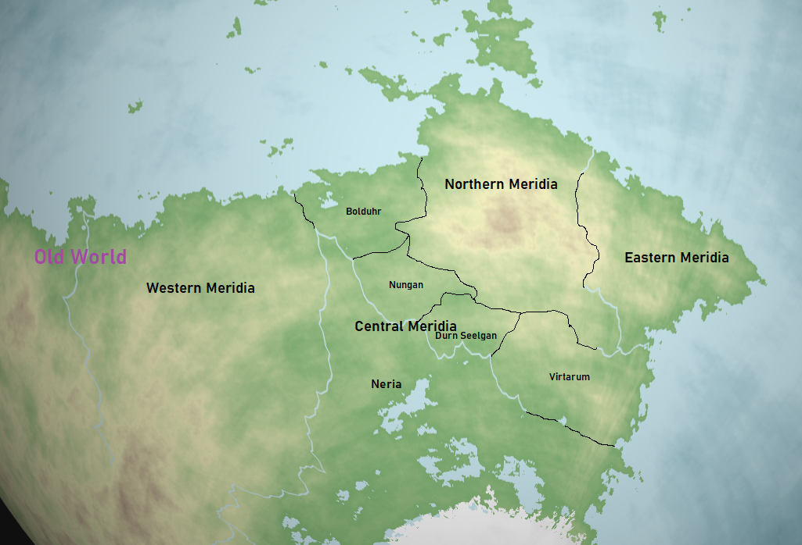

# Meridia

Meridia is a region in the South East Corner of the supercontinent Praeia on the planet Pulchra. It became one of the oldest colonized regions for life on Pulchra after a great migration from the Old World in the middle of the 4th Age. It acts as one of the two primary homes for the dwarves while being one of the earliest known locations in which modern integration between races had occurred.

| Geography | |
| - | - |
| Type | Region |
| Region | [South East Corner](../Planes/pulchra.md#south-eastern-corner) |
| Continent | [Praeia](../Planes/pulchra.md#praeia) |
| Area | 18,200,000 km2-23,500,000 km2 |

| Races | |
| - | - |
| 1326 PA | yes |

| Population | |
| - | - |
| 1326 PA | 106,000,000 |

## Geography

The geography of Meridia is split between four primary regions, each defined by their cardinal directions, with them aptly named Western, Northern, Eastern, and Central Meridia.

### Northern Meridia

Northern Meridia is by far the most diverse and wealthy region in Meridia, for many of the successful pioneers of the regions live here for the warm climate brought to it via the South Eastern Sea.

### Western Meridia

Western Meridia actually intersects and overlaps with the Old World, for it is the first of the Meridian regions ever colonized.

### Eastern Meridia

Eastern Meridia is the easternmost region on the continent of Praeia and acts as the primary location for trade between Meridia and Praetoria across the Southern Sea.

### Central Meridia

Central Meridia is a collection of 5 sub-regions known as:

- Bolduhr
- Nungen
- Durn Seelgan
- Virtarum
- Neria

## History
