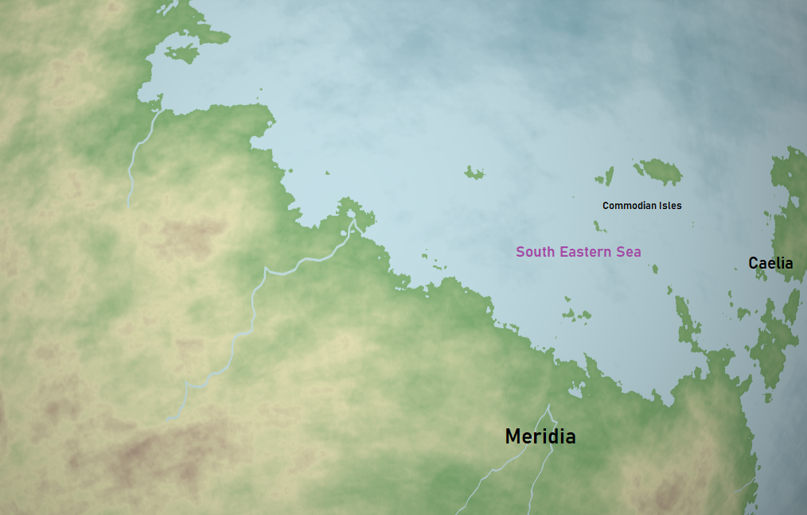

# Old World

The "Old World" is a region on the [Pulchran](../Planes/pulchra.md) supercontinent [Praeia](../Planes/pulchra.md#praeia) in which it is believed the first civilized form of life had originated. Many of the races today can find their roots from somewhere in this region, therefore there is heavy religious influence to those who live there today. Some religions claim that when the gods walked the world, this is where they stood.

Map of the Old World in 186 5A:

| Geography | |
| - | - |
| Type | Region |
| Region | [South East Corner](../Planes/pulchra.md#south-eastern-corner) |
| Continent | [Praeia](../Planes/pulchra.md#praeia) |
| Area | 11,500,000 km2-14,500,000 km2 |

| Races | |
| - | - |
| 1326 PA | yes |

| Population | |
| - | - |
| 1326 PA | 90,000,000 |

- [Geography](#description)
  - [Regions](#regions)
  - [Geographic Locations](#geographic-locations)
- [History](#history)
  - [3rd Age](#3rd-age)
  - [4th Age](#4th-age)
  - [5th Age](#5th-age)
- [Demographics](#demographics)

## Geography

The Old World is a large and central region on the Pulchran super-continent Praiea. It houses a very diverse landscape starting with its coastline with the Great Ocean and inland toward the Grancanan Hills.

### Regions

- Protar - The landscape between the Bay and Shiria rivers
- Shiria - The easternmost penninsula, and border, of the Protar region
- Grancana - The elevated landscape that surrounds the southern half of the Protar region
- Yarrath - Relatively small greenland area between the western side of Protar and Grancana
- Ismaia - The land of the Old World that is west of the Bay River
- Silandria - The land between Yarrath and Ismaia
- Iptiyabur - East of the Shiria River, this region covers the rest of the Old World's coastline until Bolduhr
- Neria - South east from Grancana which overlaps Meridia and the Old World

### Geographic Locations

- Bay River
- Shiria Rivier
- Protaran Summit
- Grancanan Hills

## History

### 3rd Age

The earliest recorded history in the Old World dates back to the first Dwarves of Moradin. It is said they came from the Protaran Summit and lived in the valleys toward the coast, but after years of strife, the dwarvish people split with some heading toward the Grancanan Hills and others east to what will eventually be Meridia.

### 4th Age

TODO

#### 0-500

#### 500-1000

#### 1000-1500

#### 1500-2000

#### 2000-2600

### 5th Age

#### Post-Cataclysm (0-24)

Due to the events of the Great Cataclysm, a great famine had occurred, affecting most, if not all, of the regions in the Old World. Over the first months and years, political stability began to wane, until eventually chaos had enveloped the populous cities. Some of the more powerful kings and lords were able to hold their own against mobs, but most perished as their government fell before them.

The following decades, new lords rose and united small lands, and the old perished. This time period was filled with constant warring and lack of stability.

One of the warring lords, and considered the most successful conquerer of the lands, Keletar Mavell, had created the first newly birthed nation after conquering all of Shiria. As this time frame of chaos had approached its end, Keletar had conquered many lands and had established order and unity between them. This unification would soon be known as the start of the Mavell Dynasty, for Keletar's growth in power had only begun.

During this time period, due to the outcome of the Meridian Wars and that of the cataclysm, the unified Western Meridia had fallen to pieces. Similar to the rest of the Old World, Western Meridia had now been divided into smaller territories governed by local Meridia lords. Western Meridia would never be united again, until the New Iptian Alliance.

#### Reconstruction (24-182)

#### Commodian Tales (182-186)

#### Mavell Conquests (186-208)

With tensions high in the South Western Corner of the world, all it took was a spark of aggression for total war to occur. This spark was the ascendence of Maldwyn Mavell as King of the Mavell dynasty. He believed it was Mavell's right to rule all that which is seen by the Gods, therefore he begun war with his neighbors.

For the next several years, the Mavell Dynasty had crushed, conquered, and absorbed surrounding kingdoms into its own. Even after the death of Maldwyn in combat, the empire had slowly grown for the next several generations, extending its influential reach. Despite not conquering the east as Maldwyn would have wanted, the Old World was still theirs to take.

#### First Western Migration (208-213)

A great migration occurred, leaving the core regions of the Old World behind and expanding the map itself. Regions such as Ismaia, Iptiyabur,and even beyond Grancana saw a great increase in settlers.

#### Colonization?? (213-302)

#### Wars of Independence (302-311)

#### New Iptian Alliance (311-344)

#### Age of the Titans (344-372)

In 344, a no name adventure group was formed in a small village in Protar. Over its 28 year time frame, this group had grown a following, reputation, and immense strength fighting extremely powerful enemies and saving their people time and time again. They became known as the Titans outside of their homeland, and eventually became deterrents of war between nations due to their power and respect attained. This would be the first time a world-influencing adventure party would exist since 13, but it also wouldn't be the last.

#### Time of the Adventurers (372-416)

## Demographics

TODO
