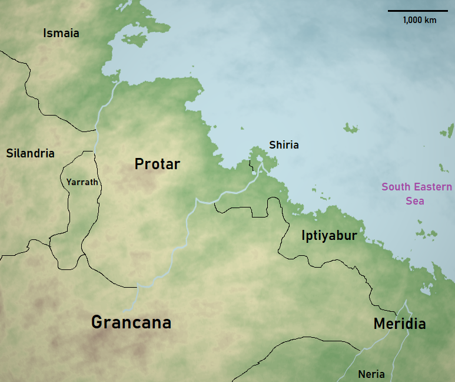

# Old World

The "Old World" is a region on the [Pulchran](../Planes/pulchra.md) supercontinent [Praeia](../Planes/pulchra.md#praeia) in which the planet's history suggests the first civilized form of life had originated. Many of the races today can find their roots from somewhere in this region, therefore there is heavy religious influence to those who live there today. Some religions claim that when the gods walked the world, this is where they lay.

| Geography | |
| - | - |
| Type | Region |
| Region | [South East Corner](../Planes/pulchra.md#south-eastern-corner) |
| Continent | [Praeia](../Planes/pulchra.md#praeia) |
| Area | 11,500,000 km2-14,500,000 km2 |

| Races | |
| - | - |
| 1326 PA | yes |

| Population | |
| - | - |
| 1326 PA | 90,000,000 |

## Geography

yes
