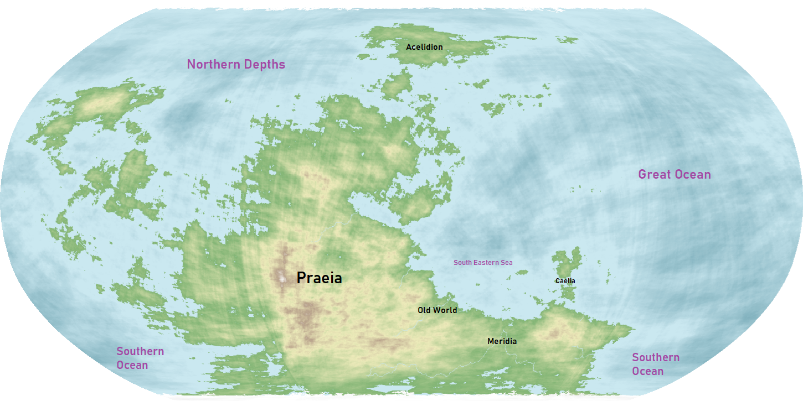
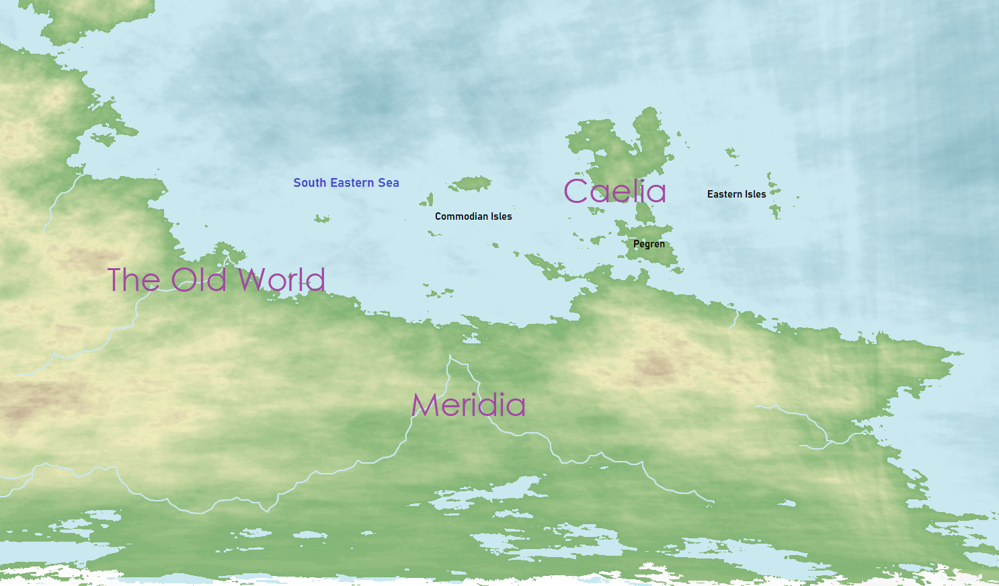

# Pulchra

Known as the Pearl of the Angels, Pulchra was the greatest achievement of an unknown species of divine beings. The planet was the embodiment of beauty and the source of attraction for the all-powerful overgods and other angels. Pulchra acts as the primary planet for the events of the various adventure campaigns and that of the ["Super Campaign"](../../Campaigns/super_campaign.md).

| Basic Information | |
| - | - |
| Type | Planet |
| Radius | 3957 mi (6366 km) |
| Satellites | Aiter |
| Orbital distance  | 112,000,000 mi (180,208,000 km) |
| Day Length | 24 hours |
| Year length | 365 days |
| Demonym | Pulchran |

| Population | |
| - | - |
| 0 [4A](../../Events/timeline.md#4th---age-of-the-ancients) | 22,000,000 |
| 1256 4A | 40,000,000 |
| 2582 4A | 144,000,000 |
| 2600 4A 0 [5A](../../Events/timeline.md#5th---age-of-the-kings) | 129,000,000 |
| 24 5A | 97,000,000 |
| 186 5A | 124,000,000 |

## Contents

- [History](#history)
- [Calendar](#calendar)
- [Geography](#geography)
  - [Continents](#continents)
    - [Praeia](#praeia)
    - [Draconia](#draconia)
    - [Acelidion](#acelidion)
    - [Caelia](#caelia)
  - [Oceans](#oceans)
    - [Great Ocean](#great-ocean)
    - [Northern Depths](#northern-depths)
    - [Southern Sea](#southern-sea)
  - [Geographical Regions](#geographical-regions)
    - [South Eastern Corner](#south-eastern-corner)
    - [Meridia](#meridia)
    - [Old World](#old-world)
    - [Praetoria](#praetoria)
- [Satellites](#satellites)

## History

Since the known existence of the Gods, four distinct ages of the world have gone by: the Age of the Angels, the Age of the Keepers, the Age of Silence, the Age of the Ancients, and the 5th and current age, the Age of the Kings. For a timeline of Pulchran history as it is now known, with dates, see the [timeline](../../Events/timeline.md).

## Calendar

A Pulchran year lasts 365 days over the course of 12 months. Each day is 24 hours in length and there are 7 days in a week. For a full list of existing calendars, refer to [calendars](../../Events/timeline.md#calendars).

## Geography

### Continents

#### Praeia

The main super-continent of the world. The vast majority of the world population and their events have lived here.

#### Draconia

An isolated continent in the corner of the world. Few travel there for it is a foreign land comprised of many dangerous creatures that have never been known to exist.

#### Acelidion

The northern most continent is covered in ice and tundra. Very few have traveled there to tell of the tales of this land.

#### Caelia

Caelia is the unification of the continent Caelus and surrounding islands, including Pegren. This region is located in the south eastern corner and is the primary location for the events of the [Caelian Trilogy](../../Campaigns/caelian_trilogy.md) adventure. For more information, visit [Caelus](../Land/caelus.md).

### Oceans

#### Great Ocean

The primary ocean of the world, it covers over half of Pulchra's surface.

#### Northern Depths

Located between Draconia and Acelidion, this ocean is known for its frigid temperatures because of the arctic air that travels down through it. Very few traverse this ocean, unless they are traveling near the coast.

#### Southern Sea

The southern most ocean of Pulchra that unites Praetoria and Meridia.

### Geographical Regions

#### South Eastern Corner

The South Eastern Corner refers to the south eastern section of the Praeian supercontinent relative to its center. It encompasses regions such as the [Old World](../Land/old_world.md), [Caelia](../Land/caelus.md), Meridia, and the South Eastern Sea.

#### Meridia

One of the two primary homes of the dwarves. It is also one of the earliest known locations in which modern integration between races had occurred. A great migration during the middle of the 4th Age brought many peoples from the Old World to Meridia, thus its history began then.

#### Old World

Being known as the origin of the world, the [Old World](../Land/old_world.md) is the oldest known location of civilized life in the world, and much of modern life today can be traced back somewhere to this region.

#### Praetoria

The crowning jewel of Elves and other beings of high stature.

## Satellites

Pulchra has one moon named Aiter.
