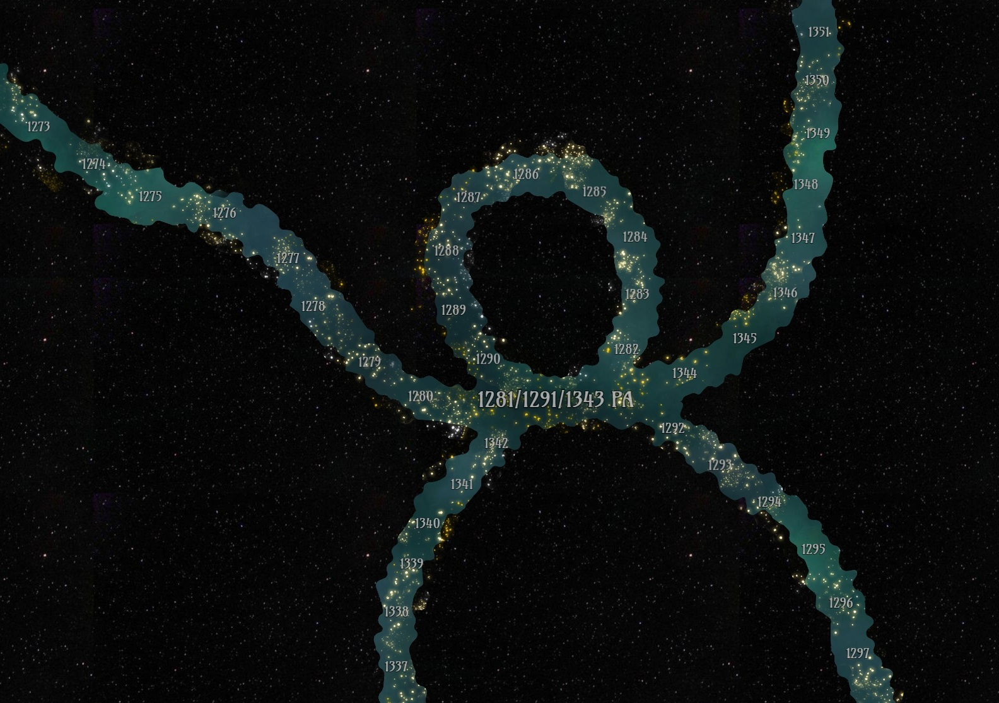

# Time Beavers

I hate you, Musawwar.

The cosmic beavers, also known as the time beavers, are cosmic entities that help to manage the flow of time in the multiverse. A common misconception is that time in the universe moves like an arrow, but rather it moves like a river that can sometimes overlap itself. The time beavers manage the flow of this river similar to how actual beavers do.

## Contents

- [Flow of Time](#flow-of-time)
  - [Known Critical Points](#known-critical-points)
- [The Beavers](#the-beavers)

## Flow of Time

Time flows like a river, in one direction similar to the arrow of time, however, the river of time is much more dynamic in the shapes it can take, whereas the arrow and straight and rigid.

The river of time can be a singular flow, split into multiple rivers, combine multiple rivers together, or even overlap on itself in key points.

### Singular Flow

In the singular flow case, time just moves forward. Nuff said.

### Divergence

In the divergence case, the river of time splits into 2 streams, similar to creating a new branch of reality. Once the river splits, there is no way for beings to cross to the parallel river. There is no discoverable pattern of why this happens, other than the fact it is the most common form of time events.

### Convergence

Convergence is the theoretical behavior of two streams of time uniting into one. This is purely theoretical for no actual examples have been found.

### Critical Points

Sometimes the river may overlap on itself, thus overlapping moments in time with others. This overlapping in the river is called a "critical point" in time and causes said events in time to seemingly happen together at once.

A critical point also allows a being to phase between the two times that overlap one another, thus in a way allowing them to travel "through time" into another age. It is not known why critical points exist other than it seeming to be natural to the existence of the river of time itself.

Below is an artist's rendition of the "13-Point" critical point [13](../../Characters/13/13.md) and [Miirakail](../../Characters/miirakail.md) were able to take advantage of during the events of [Death of a Dragon](../../Campaigns/caelian_trilogy.md#death-of-a-dragon) for the years 1281, 1291, and 1343 PA. 3 different times being united together is considered a Triple Critical Point:

### Absolute Points

An absolute point is categorized by the following:

1. A common event that occurs between multiple streams of the river, regardless of how they do or no not relate
1. A lead up with large inter and intra-dimensional activity never-before seen in that stream prior
1. What can be observed as the end of the stream itself, where most, if not all, activity in that stream ends with no chance of recovery. Often this is associated with great cataclysms that destroy the relevant universe entirely

Scholars often compare absolute points to dams built by the cosmic beavers, however, there is no evidence that the beavers have anything to do with absolute points other than them cleaning up the cosmic waste left behind an ended stream.

### Known Critical Points

| Name | Years United | Phase Frequency |
| - | - | - |
| Mystra's Wish | 1101 4A 212 5A | 2.34 GHz |
| Unknown | 1411 4A 1563 4A | 114.5 MHz |
| Unknown | 934 PA 1216 PA | 291.3 MHz |
| 13-Point | 1281 PA 1291 PA 1343 PA | 313.4 MHz |

## The Beavers

It is not known in totality what role the cosmic beavers have, however what is known is as follows:

- They appear as massive beavers in space. Their eyes glow white with a golden hue
- They transcend time, for they manage facets of the river mere mortals cannot
- They manage the death and cleanup of streams who hit their absolute points. The cleanup involves them dropping the respective stream's universe into the infinite plane of [Limbo](limbo.md) to rest for eternity
- Any potential beings that transcend time like the beavers do are removed by the beavers from both the streams and the realm in which the river resides
- Their power must be near or at the level of the Gods
