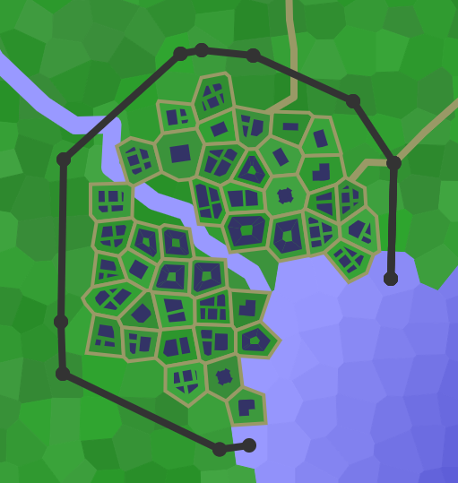

# Casta

Casta was a village on the eastern side of the Caelian continent. It was the starting location of the [Rise of Ebrihan](../../Campaigns/caelian_trilogy.md#rise-of-ebrihan) adventure in the [Caelian trilogy](../../Campaigns/caelian_trilogy.md) campaign.

Below is an image of Casta before its destruction:

| Geography | |
| - | - |
| Type | Port city |
| Region | [Ebrihan](../Land/caelus.md#ebrihan), [Caelus](../Land/caelus.md) |
| Size | Large village |

| Society | |
| - | - |
| Demonym | Castan |
| Races | In 1326 PA: - 80% Human - 10% Half-races - 6% Orc - 4% Other |

| Politics | |
| - | - |
| Gov't type | Noble Family |
| Ruler | Tyndall Family |

| History | |
| - | - |
| May, 1326 PA | Destruction (by Reigith) |
| Population | 600 in March, 1326 PA |

## Geography

Casta sat at the eastern-most mouth of the Ebrihan river.

## Notable Locations

### Inns and Taverns

- The Wanderer's Hare

### Shops

- The League Shanty

### Other Locations

- Casta Jailhouse
