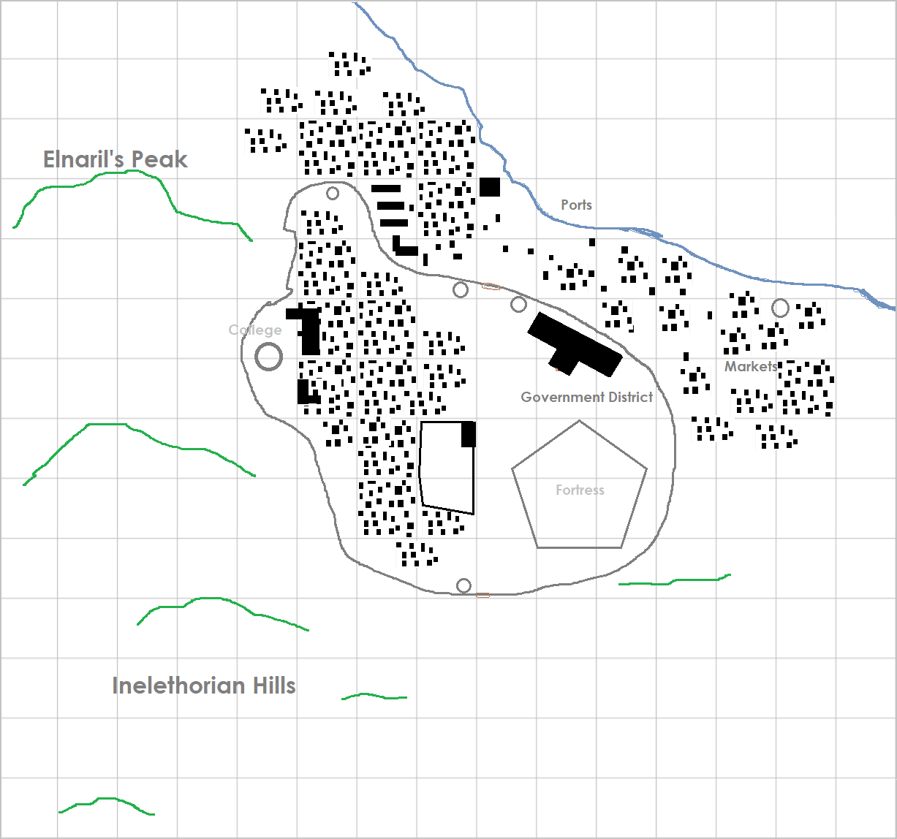

# Inelethor

Inelethor in 1344 PA before the [Great Cataclysm](../../Events/great_cataclysm.md)

| Geography | |
| - | - |
| Type | Port city |
| Region | Ghili Peninsula, [Northern Meridia](TODO) |
| Size | Big city |

| Society | |
| - | - |
| Demonym | Inelethorian |
| Races | In 1326 PA: - 50% Human - 20% Dwarf - 15% Elf - 15% Other |

| History | |
| - | - |
| 930 4A | Settlement founded |
| 1043 4A | Inelethor founded |
| 2600 4A 1344 PA | Destruction |
| 31 PC | Reestablished |
| Population | 186,000 in 1326 PA 192,000 in early 1344 PA 37,000 in late 1344 PA 248,000 in 162 PC |
