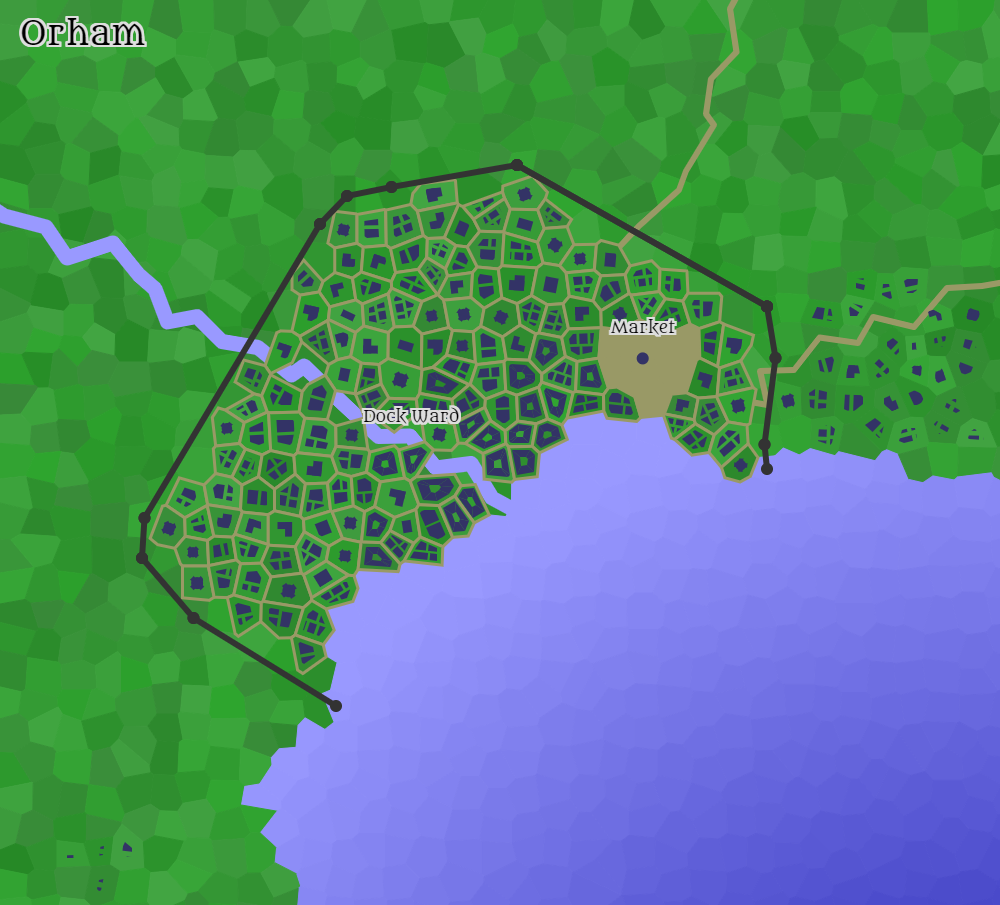

# Orham

| Geography | |
| - | - |
| Type | Port city |
| Region | [Ebrihan](../Land/caelus.md#ebrihan), [Caelus](../Land/caelus.md) |
| Size | Average Town |

| Society | |
| - | - |
| Demonym | Orhamin |
| Races | In 1326 PA: - 90% Human - 10% Other |

| Politics | |
| - | - |
| Gov't type | Plutocracy |
| Ruler's type | [Council of the Coast](#council-of-the-coast) |

| History | |
| - | - |
| Settled and founded | 612 PA |
| Population | 3,000 in 1326 PA |

## Geography

Orham sits at the western-most mouth of the Ebrihan river.

## History

TODO

## Notable Locations

### Inns and Taverns

- Hooded Maiden

### Shops

- [Randy Randy-Handy Randy-Randy's Randy
Incorporated](../../Factions/Organizations/randys_co.md)

### Other Locations

- Lord Belda's Mansion
- Ningal's Fortress
  - Underground network of fortified rooms. It was originally created to store armaments during the [War of the Fields](../../Events/war_of_the_fields.md), but afterwards was abandoned. It later turned into the headquarters for the [Ravens](../../Factions/Organizations/ravens.md).

## Council of the Coast

The council of the coast is a body of nobles who rule over Orham and manage its affairs. They hold all public economic and political power in the city, for the underground network is ruled by the Ravens and hold substantial power as well.

The only other true influence over Orham is the Duke of Ebrihan.

### Known Members

- [Lord Saywin Belda](../../Characters/saywin_belda.md)
